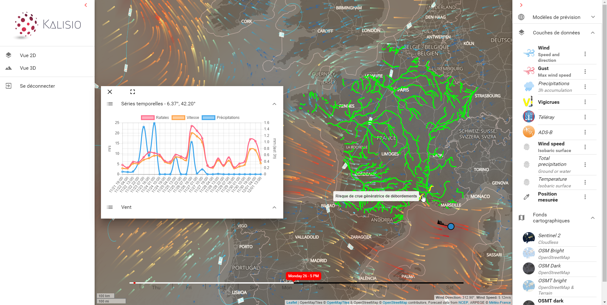

# Introduction

**Kano** is a powerful client application that can be used to visualize geospatial data served by [Kargo](https://kalisio.github.io/kargo/).

::: tip
This application is based on the [Kalisio Development Kit](https://kalisio.github.io/kdk/).
:::

