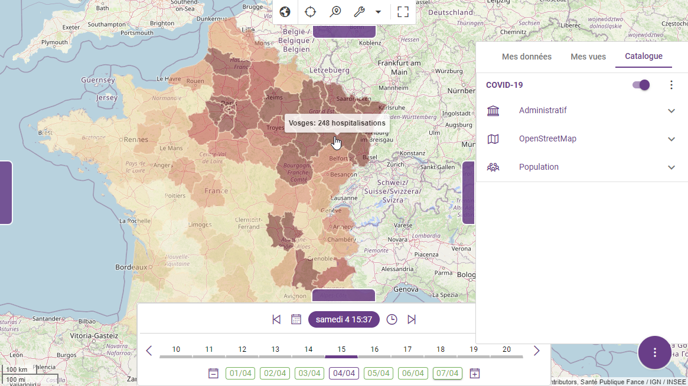

# Customizing Kano

This section details different approaches to integrate your own data to your Kano instance. Although you can directly use the Kano UI to add your own data layers this section provide details to do this by configuration or programmatically. When added through the UI, the different layers will be visible in the *My data* tab of the [catalog panel](../guides/getting-started.md#catalog), while the default built-in layers will appear in the *Catalog* tab of the [catalog panel](../guides/getting-started.md#catalog). You can also manage the **categories** (i.e. catalog sections) hosting the layers from the UI or the configuration.

Although names and descriptions can be hard-coded in the target user language, Kano supports internationalization through a nested structure organized by locale like this:
```js
{
	name: 'Categories.POPULATION_LAYERS',
  i18n: {
    fr: { Categories: { POPULATION_LAYERS: 'Population' } },
    en: { Categories: { POPULATION_LAYERS: 'Population' } },
    ...
  }
}
```

> Note that the `name` property is used a unique identifier for categories and layers

## Customizing the catalog

You can add your own categories in the catalog by defining it in additional files to be put in the `kano/api/config/categories` directory. Kano will glob all files within this directory and add categories accordingly, only matching by name those in the `CATEGORIES_FILTER` (comma-separated list of category names) environment variable, if any. Categories are simple objects with a name, a description and an icon from a standard icon set among [Material Icons](https://fonts.google.com/icons?icon.set=Material+Icons), [Font Awesome](https://fontawesome.com/icons), or [Line Awesome](https://icons8.com/line-awesome).

::: details my-categories.cjs - Used to define additional categories.

<<< ../.vitepress/public/my-categories.cjs
:::

Layers that will be added in a given category depends on the `filter` property content, which defines a [sift filter](https://github.com/crcn/sift.js) applied to the layers list. Although any filter can be used, a `tags` property containing an array of relevent tags is often used by convention.

## Customizing the catalog data

You can add your own layers in the catalog by defining it in additional files to be put in the `kano/api/config/layers` directory. Kano will glob all files within this directory and add layers accordingly, only matching by name those in the `LAYERS_FILTER` (comma-separated list of layer names) environment variable by default (set it to `*` to remove filtering). Layers are simple objects with a name, a description, a type, an attribution, and additional configuration options related to the underlying mapping engine: [Leaflet](https://leafletjs.com/) for 2D rendering and [Cesium](https://cesium.com/) for 3D rendering. More details about these options can be found in the documentation of the [KDK](https://kalisio.github.io/kdk/api/map/) powering Kano.

> Please refer to the built-in `kano/api/config/layers` directory for various examples of what is possible to do with Kano.

We will start with a really simple example by adding two different map backgrounds based on [OpenStreetMap data](https://www.openstreetmap.org/) to your Kano instance. First ensure you copied the categories and layers files in their respective directories in `kano/api/config`. Then, set `CATEGORIES_FILTER="OSM_LAYERS POPULATION_LAYERS"` and `LAYERS_FILTER="OSM OSM_CYCLE"` in your environment. Last, launch Kano to make the layers appear in your custom catalog.

::: details osm-layers.cjs - Used to define base layers with OpenStreetMap data.

<<< ../.vitepress/public/osm-layers.cjs
:::

Except for raster data, vector data are always converted to GeoJson upfront or as a rendering preprocessing phase in Kano.

### Using OGC standards

OGC Web Services (OWS) are the [OGC standards](https://www.ogc.org/standards/) that use the internet to view, edit, manage and share geospatial data. You can notably use the following standards in Kano:
* Web Map Services (WMS)
* Web Map Tile Service (WMTS)
* Tile Map Service (TMS)
* Web Feature Service (WFS)
* Web Coverage Service (WCS)

In this section we will use OGC web services of the [French geographical institute](https://geoservices.ign.fr/services-web-experts) (IGN). First copy the new layers file in the `kano/api/config/layers` directory. Then, add `"POPULATION_DENSITY_WMTS POPULATION_DENSITY_WMS AIRPORTS_WFS"` to your `LAYERS_FILTER` environment variable and launch Kano again to make the new layers appear in your custom catalog.

::: details ogc-layers.cjs - Used to define additional layers using different protocols like WMTS, WMS and WFS.

<<< ../.vitepress/public/ogc-layers.cjs
:::

You now should be able to see this after making some of the layers active:


Due to the possible large amount of vector data coming from the WFS the layer is configured with `minZoom` and `tiled` property so that data is only retrieved when zoom level exceed 10 for visible tiles only.

### Using data files

Except by using the UI, there are two ways of adding data coming from a file based on configuration:
1. serve and directly access the file over HTTP,
2. ingest the file data into the database and access it using a built-in web service.

The second option is mandatory for large datasets or if you'd like to perform some filtering based on data feature properties. Accessing data stored in the database rely on the concept of [FeathersJS service](https://feathersjs.com/api/services.html). As a consequence, the layer is usually associated with one (or more) source service where the data come from. Moreover, you should define a unique `featureId` on your features so that Kano can correctly separate and update data.

> The data can be retrieved from a raw file with the `fileName` layer property or a remote file with the `url` layer property.

You should have a look to our detailed documentation for all possible styling options in [2D](https://kalisio.github.io/kdk/api/map/map-mixins.html#map-style) or [3D](https://kalisio.github.io/kdk/api/map/map-mixins.html#globe-style).

First copy the new layers file in the `kano/api/config/layers` directory. Then, add `"REGIONS DEPARTMENTS"` to your `LAYERS_FILTER` environment variable and launch Kano again to make some new layers appear in your custom catalog.

::: details file-layers.cjs - Used to define additional layers using file data.

<<< ../.vitepress/public/file-layers.cjs
:::

You now should be able to see a map highlighting some administrative boundaries in France:


If you have to ingest large datasets you should consider processing data using our [ETL Krawler](https://kalisio.github.io/krawler/) or ad-hoc processors. For instance, [k-population](https://github.com/kalisio/k-population) ingest population data from a big GeoPackage into our database. You will find the associated layer definition in the built-in layers.

#### Time-varying data

One of the best feature of Kano is interactive visualisation, meaning that data can be updated in real-time according to user actions or data updates. A typical use case is the visualisation of time-varying spatial datasets. In this section we will use some data providing the number of hospitalizations by department in France during the COVID-19 (from 20-03-2020 to 20-04-2020) to perform such a visualisation.

In this example there is one GeoJson file per day. First extract the [data files](/covid-19.tar.gz) to the `public` folder exposed by Kano. Then copy the new layers file in the `kano/api/config/layers` directory. Last, add `"COVID_19"` to your `LAYERS_FILTER` environment variable and launch Kano again to make the new layers appear in your custom catalog.

::: details covid-19-layers.cjs - Used to define additional time-varying layers based on file data.

<<< ../.vitepress/public/covid-19-layers.cjs
:::

Using the bottom timeline, navigate to some dates within the data time range, you now should be able to see a choropleth map highlighting the number of hospitalizations for each date:



You can even do the same using the 3D activity:


### Using the API

The Kano API is particularly useful to update data continuously, a typical use case is data coming from network sensors performing measurements on the ground.

::: warning
You should use the `local.cjs` configuration file as stated in the [installation](./installing-kano.md) section to setup a user account with appropriate rights (i.e. write acces to the API).
:::

The different service endpoints of Kano can be accessed using REST as the most universal interface or using WebSockets if required (typically for complex queries or performance issue). The access to the endpoints are protected using a [JWT](https://jwt.io/) (i.e. token), it must be defined using the `Authorization` header (`Bearer token`) in the request header for REST. 

For instance using CURL you will send a request to the API like this (the body of the request being in the `data.json` file):
```bash
SET TOKEN="xxx"

curl -X POST -H "Authorization: Bearer %TOKEN%" ^
     -H "Content-Type: application/json" ^
     -d @data.json ^
     https://kano.dev.kalisio.xyz/api/service
```

Detailed information about the concepts and the data model behind our feature services can be found in [the KDK documentation](https://kalisio.github.io/kdk/api/map/services.html#features-service), although focused on how to retrieve the data.

To push a new station the body of the request will be a GeoJson feature like this:
```js
{
  "properties": {
    "id": "174412d9e-f230-4127-af36-75654e265f56",
    "name": "Station 1"
  },
  "geometry": {
    "type": "Point",
    "coordinates": [
      1.5059948323127268
      43.547168883180966,
      0
    ]
  },
  "type": "Feature"
}
```

To push a new measure of the station the body of the request will be (a) GeoJson feature(s) like this:
```js
// Single or multiple measures can be sent at once
[{
  "time": "2023-04-28T16:00:00",
  "properties": {
    "id": "174412d9e-f230-4127-af36-75654e265f56",
    "value": 24,
    "status": "OK"
  },
  "geometry": {
    "type": "Point",
    "coordinates": [
      1.5059948323127268
      43.547168883180966,
      0
    ]
  },
  "type": "Feature"
}, ...]
```

First copy the new layers file in the `kano/api/config/layers` directory. Then, add `"SENSORS"` to your `LAYERS_FILTER` environment variable and launch Kano again to make the new layers appear in your custom catalog.

::: details sensors-layers.cjs - Used to define additional sensors layers based on API data feeding.

<<< ../.vitepress/public/sensors-layers.cjs
:::

Now, feed the API using the provided data in the public folder of the documentation:
```
curl -X POST -H "Authorization: Bearer %TOKEN%" -H "Content-Type: application/json" ^
     -d @stations-data.json https://your.kano.domain/api/sensors-stations
curl -X POST -H "Authorization: Bearer %TOKEN%" -H "Content-Type: application/json" ^
     -d @observations-data.json https://your.kano.domain/api/sensors-observations
```

::: tip
For testing purpose you can get a valid token from the local storage in the developer tool after logged into Kano.
:::

Using the bottom timeline, navigate to a date/time with existing sensor data, you now should be able to see your sensor on the map, selecting it should open the value timeseries:


A data layer can contain multiple time-varying elements called *variables*. The features may contain additional properties, e.g. a status (OK/NOK), a name, etc. that can be used to customize the rendering, e.g. icon, color, tooltip, etc.

The main [configuration options](https://kalisio.github.io/kdk/api/map/services.html#catalog-service) are the following:
* the property that will be use to uniquely identify a station (i.e. ID)
* the refresh rate of the data in the layer (used to automatically update the view every N seconds in Kano)
* the *life time* of a measure, i.e. if no measure found within the range `current time - life time` the station is not considered to have performed any measure for current time
* the list of the variables contained in the data with associated properties to ease timeseries display (unit, range, color, ...)

::: tip
A layer can have no fixed stations but only measurements from sensors in order to display moving data
:::

## Customizing the catalog legend

**To be completed**