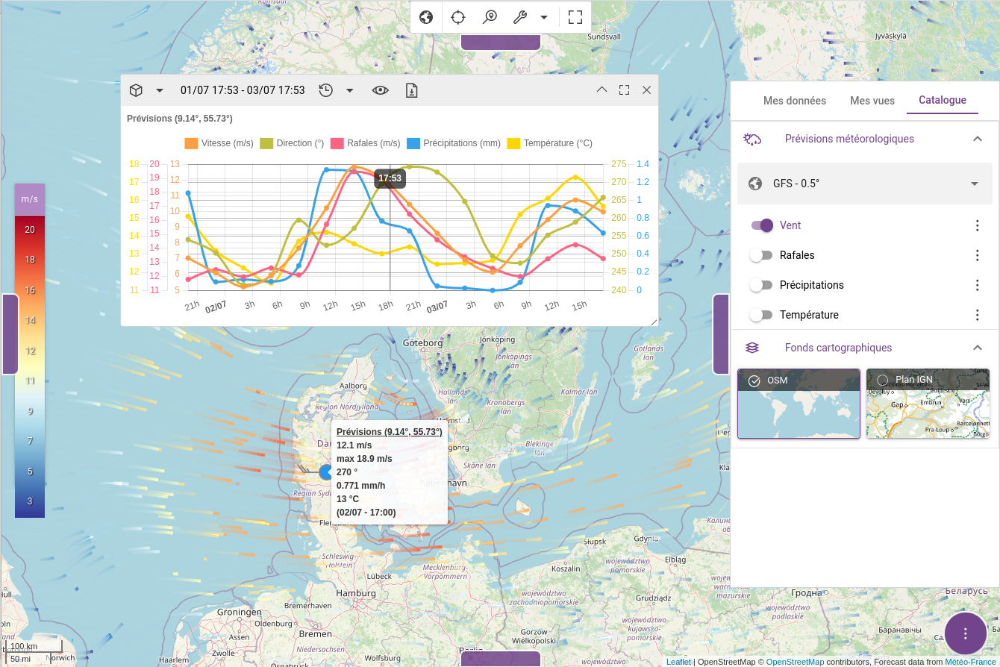
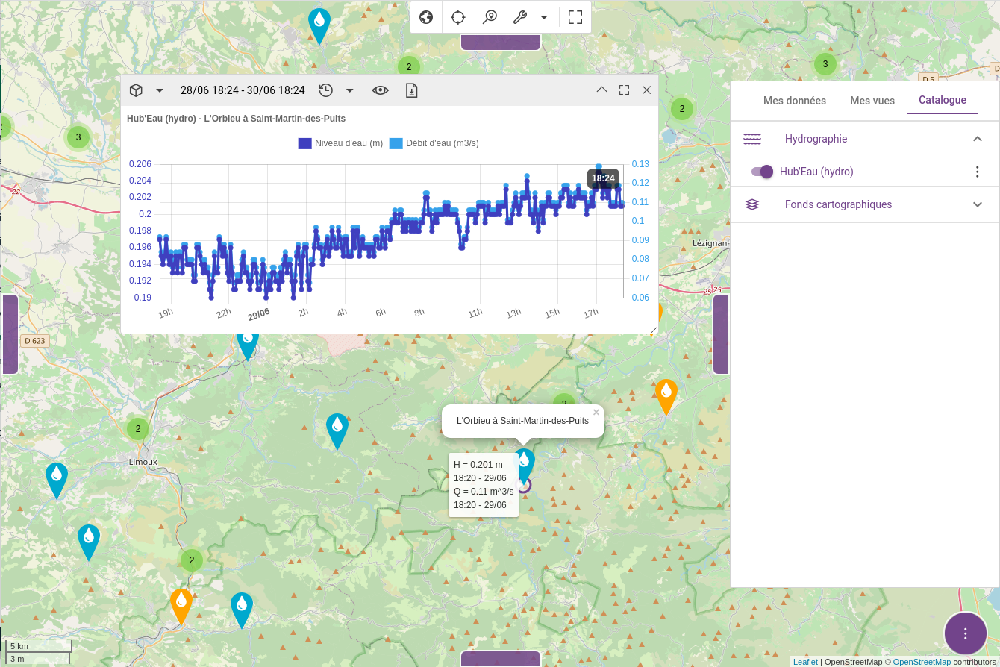

# Installing Kano

## Using Docker

::: warning 
This requires you to [install Docker](https://docs.docker.com/engine/installation/), the world’s leading software container platform.
::: 

We provide Docker images on the [Docker Hub](https://hub.docker.com/r/kalisio/kano/) to ease deploying your own instance. To run correctly it has to be linked with a standard [MongoDB container](https://hub.docker.com/_/mongo/) for the database. Although it's possible to directly run Docker commands we provide you with [docker-compose](https://docs.docker.com/compose/) files to ease deployment, in addition to minimalist configuration files. These files will be detailed in the following sections and are available in the [public folder](https://github.com/kalisio/kano/tree/master/docs/.vuepress/public) of the documentation.

Jump into the folder with the docker-compose and configuration files, the following commands should do the job:

```bash
// Run the MongoDB and Kano containers
docker-compose up -d

// Stop the MongoDB and Kano containers
docker-compose down
// Stop the MongoDB and Kano containers erasing DB data
docker-compose down -v
```

Then point your browser to [localhost:8080](http://localhost:8080). You should see something like this once connected:


::: tip
Check the `local.cjs` configuration file below to find the required login information
:::

::: warning
If running Docker under Windows in a virtual machine first redirect the port 8080 of your virtual machine to your host
:::

::: details docker-compose.yml - Used to deploy MongoDB and Kano containers.
<<< @/.vuepress/public/docker-compose.yml
:::

Kano comes with a default set of users but you should change this default configuration for a public deployment and avoid leaking login/passwords. Similarly, Kano comes with a default set of layers targeting geospatial services deployed by [Kargo](https://kalisio.github.io/kargo/) and you should add your own data layers instead. This is done by configuration using the following files:

::: details local.cjs - Used to override the default backend configuration and setup a default user.
To be put in the `kano/api/config` directory.

<<< @/.vuepress/public/local.cjs
:::
::: details my-layers.cjs - Used to define the available default layers.
To be put in the `kano/api/config/layers` directory. Example based on OpenStreeetMap [tile servers](https://wiki.openstreetmap.org/wiki/Tile_servers) and [IGN web services](https://geoservices.ign.fr/services-web-experts-cartes).

<<< @/.vuepress/public/my-layers.cjs
:::

As detailed in the [KDK documentation](https://kalisio.github.io/kdk/guides/development/deploy.html#deployment-flavors) Kano comes into three different flavors. By default the docker-compose file targets the latest development version (`dev` tag) but you can change it to target either a beta (`test` tag) or a production (`prod` tag) release.

::: warning
By default no built-in layers are available in Kano unless you specify their names using the `LAYERS_FILTER` environment variable. By defining `LAYERS_FILTER=*` you will get all built-in layers but take care that a lot of them requires additional services to work correctly (read following sections below). You can however directly add new layers using the Kano GUI (through the add layer button or by drag'n'drop on the map).
:::

::: tip
If you'd like to use the 3D mode or the Mapillary layer you should provide the required tokens to access their respective APIs on the backend side by setting the following environment variables: `CESIUM_TOKEN`, `MAPILLARY_TOKEN`.
:::

### Add weather forecasts

Kano integrates smoothly with [Weacast](https://weacast.github.io/weacast/) in order to display weather forecast data. You can also use Docker containers to run Weacast by following [this guide](https://weacast.github.io/weacast/guides/basics.html#the-easy-way-using-docker) and taking care of port conflicts as they use the same by default.

The following commands and additional docker-compose file should do the job:

```bash
// Run the MongoDB, Weacast and Kano containers
docker-compose -f docker-compose.yml -f docker-compose-weacast.yml up -d

// Stop the MongoDB, Weacast and Kano containers
docker-compose -f docker-compose.yml -f docker-compose-weacast.yml down 
// Stop the MongoDB, Weacast and Kano containers erasing DB data
docker-compose -f docker-compose.yml -f docker-compose-weacast.yml down -v
```

Wait a couple of minutes so that Weacast feeds the database with the latest forecast then point your browser to [localhost:8080](http://localhost:8080). You should see something like this once connected if you display some meteorological layers and probe a location:



::: details docker-compose-weacast.yml - Used to deploy Weacast container.
<<< @/.vuepress/public/docker-compose-weacast.yml
:::

::: tip
You should activate the built-in Weacast layers like `WIND_TILED` in Kano using the `LAYERS_FILTER` environment variable.
:::

### Add krawler jobs

Kano integrates smoothly with [Krawler jobs](https://kalisio.github.io/krawler) in order to feed data for near real-time measurements/observations layers. A lot of built-in layers requires the associated job(s) to be deployed beside Kano. You can search for available jobs in our [GitHub organisation](https://github.com/orgs/kalisio/repositories?language=&q=krawler&sort=&type=all) and find more information about available layers in [Akt'n'Map catalog](https://aktnmap.com/gofurther/catalog.html).

For the purpose of this documentation we will focus on the [k-hubeau](https://github.com/kalisio/k-hubeau) hydro jobs but others jobs work similarly. The following commands and additional docker-compose file should do the job:

```bash
// Run the MongoDB, Hubeau jobs and Kano containers
docker-compose -f docker-compose.yml -f docker-compose-hubeau.yml up -d

// Stop the MongoDB, Hubeau jobs and Kano containers
docker-compose -f docker-compose.yml -f docker-compose-hubeau.yml down 
// Stop the MongoDB, Hubeau jobs and Kano containers erasing DB data
docker-compose -f docker-compose.yml -f docker-compose-hubeau.yml down -v
```

Wait a couple of minutes so that the jobs feeds the database with the latest observations then point your browser to [localhost:8080](http://localhost:8080). You should see something like this once connected if you display the observations layer, zoom in and pick a station:



::: details docker-compose-hubeau.yml - Used to deploy Hubeau jobs containers.
<<< @/.vuepress/public/docker-compose-hubeau.yml
:::

::: tip
You should activate the built-in Hub'Eau layers like `HUBEAU_HYDRO` in Kano using the `LAYERS_FILTER` environment variable.
:::

## From source code

First you have to ensure the [KDK prerequisites](https://kalisio.github.io/kdk/guides/development/setup.html#prerequisites) to run Kano from source code.

::: warning
At the time of writing Kano v2.x (`master` branch) is expected to work with KDK modules v2.x (`master` branch and Node.js 16.x) and Kano v1.x (`test` branches) is expected to work with KDK modules v1.x (Node.js 12.x)
:::

Then the following commands, assuming you have a MongoDB instance running on local host and default port (27017), should launch your local instance of Kano:

```bash
// Clone KDK
git clone https://github.com/kalisio/kdk.git
cd kdk
yarn install
yarn link

// In another terminal clone Kano
git clone https://github.com/kalisio/kano.git

// Set the most minimalist environment to run server
export APP_SECRET="xxx"
export LAYERS_FILTER="OSM PLAN_IGN CESIUM_ELLIPSOID"

// Run the server/API
cd kano/api
// Copy custom configuration files
cp local.js config
cp my-layers.js config/layers
yarn install
yarn link @kalisio/kdk
yarn dev

// In another terminal run the client app
cd kano
yarn install
yarn link @kalisio/kdk
yarn dev
```

Point your browser to [localhost:8080](http://localhost:8080).

### Add weather forecasts

Instead of using Docker containers you can directly install Weacast from the source code as well by following [this guide](https://weacast.github.io/weacast/guides/basics.html#the-hard-way-from-source-code). You should however take care of port conflicts as it uses the same than Kano by default (API and NodeJS debugger), the following commands should do the job:
```bash
// Clone Weacast
git clone https://github.com/weacast/weacast.git
cd weacast
yarn install

// Set the most minimalist environment to run server
export PORT="8082"
export NODE_OPTIONS="--inspect-port=9230"
export LOADERS="gfs"

// Run the server/API
cd packages/api
yarn dev
```

::: tip
You should activate the built-in Weacast layers like `WIND_TILED` in Kano using the `LAYERS_FILTER` environment variable.
:::

### Add krawler jobs

Instead of using Docker containers you can directly install Krawler from the source code as well by following [this guide](https://kalisio.github.io/krawler/guides/installing-krawler.html) and retrieve/run required jobs manually, it's notably useful when developing new jobs:
```bash
git clone https://github.com/kalisio/krawler
cd krawler
yarn install
yarn link
// Now you can proceed with your jobs
git clone https://github.com/kalisio/k-hubeau
yarn install
yarn link @kalisio/krawler
// Set the most minimalist environment to run the jobs
export DB_URL=mongodb://mongodb:27017/kano
// Now you can launch the jobs manually using the krawler CLI
krawler ./jobfile-hydro-stations.js
krawler ./jobfile-hydro-observations.js
```

## Use Kargo services

You can easily connect Kano with geospatial services deployed by [Kargo](https://kalisio.github.io/kargo/) through its [API gateway](https://kalisio.github.io/kargo/guides/advanced-usage.html#using-the-api-gateway). First add the Kano application/consumer in the gateway configuration by generating a [UUID](https://www.uuidgenerator.net/):
```
users: {
  my_user: {
    'kano': {
      scopes: ['wms', 'wmts', 'tms', 'wfs', 'wcs', 'k2'],
      credential: {
        type: 'jwt',
        keyId: '9ba09ead-23e1-4020-9994-aa9130782b09',
        keySecret: '${APP_SECRET}'
      }
    }
  }
}
```
Then add the following environment variables before launching the Kano backend:
```bash
// Setup the target gateway
export API_GATEWAY_URL="https://api.your.kargo.domain"
export APP_ID="9ba09ead-23e1-4020-9994-aa9130782b09"
yarn dev
```
This will automatically generate a valid token for the gateway once you log in and add it to any request targeting a service behind the gateway.

Kargo can also automatically deploy for you krawler jobs, kapture, k2, etc. as [services](https://kalisio.github.io/kargo/guides/understanding-kargo.html#service).