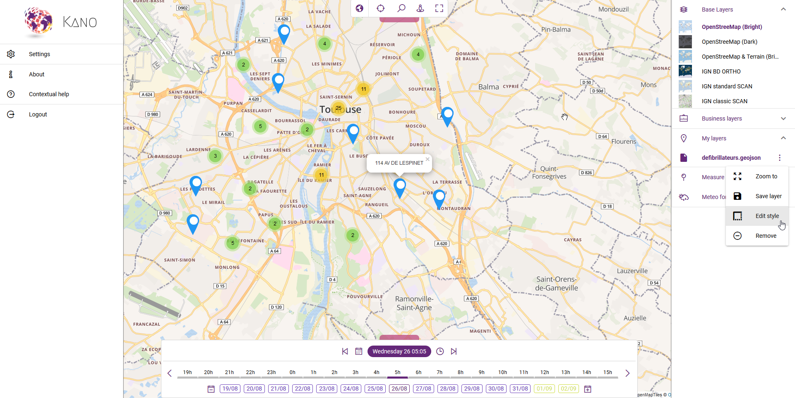

# Understanding Kano

**Kano** is a powerful [geospatial visualizer](https://en.wikipedia.org/wiki/Geovisualization) supporting advanced visualization capabilities in 2D and 3D thanks to hardware acceleration with WebGL technology. Driven by today's most advanced web technologies, it also enables tracking your geospatial assets in real-time.

Although Kano is a web application for end-users, it has also been designed to be integrated in third-party business applications and customized by developers (check out [advanced usage](./advanced-usage.md)). Using a single and simple API, Kano provides developers with the capability to easily develop 2D and 3D geospatial applications (check out [the API reference](../reference/api.md)). Last but not least, Kano comes with a built-in configuration for a set of geospatial data (check out [installation guide](./installing-kano.md)). However, you can complete it with your [own spatial data](./customizing-kano.md).

## Key concepts

Here is a quick rundown of the *key concepts* to handle when you're just getting started with Kano or mapping.

Kano is composed of two main activities (i.e. entry point for interacting with the user on a given type of objects):
* a **2D activity** to visualise and interact with data on a standard *paperless* map in 2D,
* a **3D activity** to visualise data and interact with on a [virtual globe](https://en.wikipedia.org/wiki/Virtual_globe) in 3D.

The view of each activity can contain a a **basemap** (i.e. a background context), a set of data **layers** (i.e. business specific data), an **extent** (i.e. the part of the Earth currently on the screen), and navigation tools to pan and zoom. A layer specifies how a geographic dataset is portrayed on the map or the globe. The final rendering supporting your use case can usually be assembled by adding a serie of layers.

A **feature layer** is a grouping of similar geographic elements, for example, buildings, cities, roads, earthquake epicenters, etc. Features can be points, lines, or polygons (areas). Feature layers are most appropriate for visualizing your own data on top of your basemaps. Using Kano, you can view, save, edit and analyze your own features and their attributes. Moreover, you can include interactive pop-up windows with information about the features.

Kano manages both **space** and **time** information in order to visualize time-varying geospatial phenomena: tracking of moving objects, history of measures taken by a sensor, weather prediction over time, etc. When a layer displays a time-varying dataset you are able to navigate back and forward in time using a **timeline** to see the data at your requested date/time.

## Global overview

The following figure depicts the default 2D activity and the main application components:

::: tip
The 3D view is pretty similar to the 2D activity except that some feature might not be yet available.
:::

Each component can be shown/hidden through a handle on the different side of the view:
* at the top to open the **application bar**,
* at the bottom to open the **timeline**,
* on the left to open the **side/main menu**,
* on the right to open the **catalog**.

In addition, a **floating action button** <i class="las la-ellipsis-v la-2x"></i> is available in the bottom-right corner to perform some actions.

Check out now our [quickstart guide](./getting-started.md) for more details.
